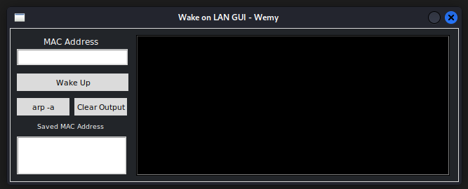
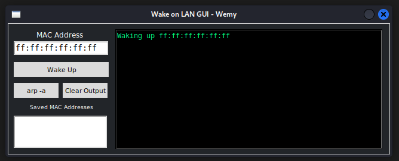

Because I'm lazy and I dont want to get up every time I need to boot up my proxmox server, I made this.

It's basically just [this script](http://wiki.bashlinux.com/index.php/Wake-on-LAN) but with a GUI (made with tkinter) on top of it.

---

**Usage** :  
Simply enter a MAC address and press wake up

 

**TO DO**:
Make the `saved MAC Addresses` box working, for now it's just a simple text box.
